# DecisionHub

A Rule Builder application “Decision Hub” that empowers Business Analysts to create, save, and visualize decision strategies. Provide a no-code rule writing experience and visual representation to test these rules in real-time and observe the calculations at each step.

#### Web Link: https://decisionhub.netlify.app/

| Architecture                      |
| --------------------------------- |
||

| Dashboard                         |
| --------------------------------- |
| 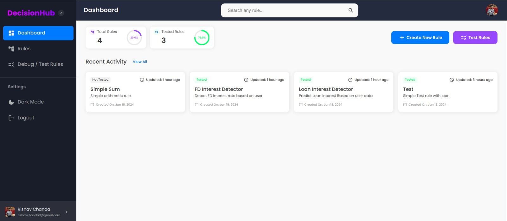 |

| Rules                          |
| ------------------------------ |
| 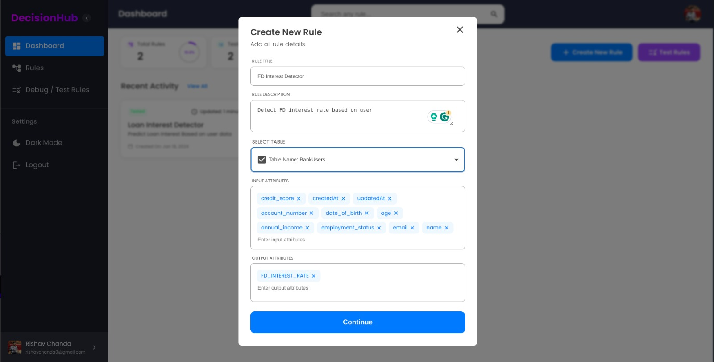 |
| 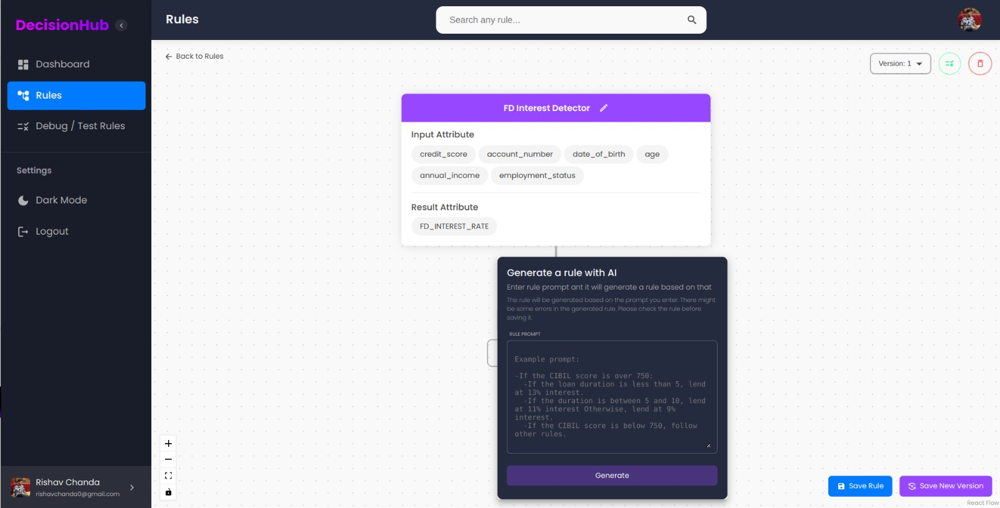 |
| 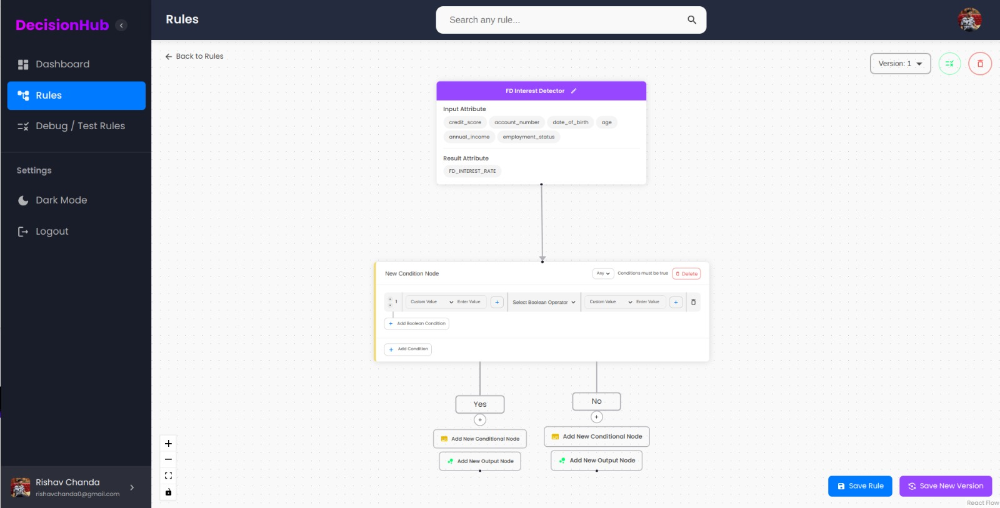  |

| Debug / Test Rules                 |
| ---------------------------------- |
| 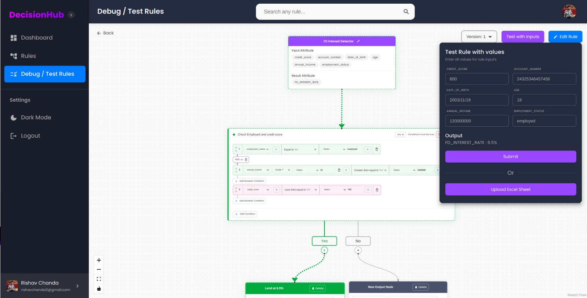   |
| 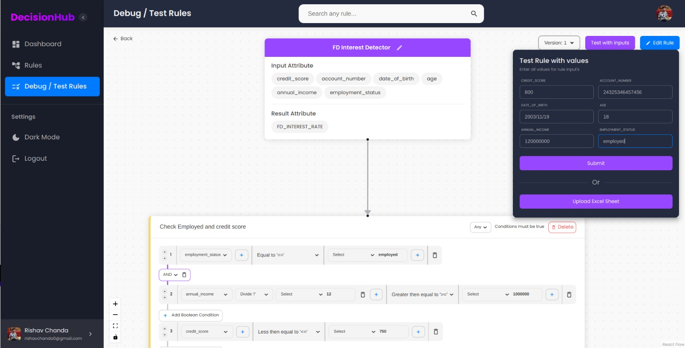  |
| 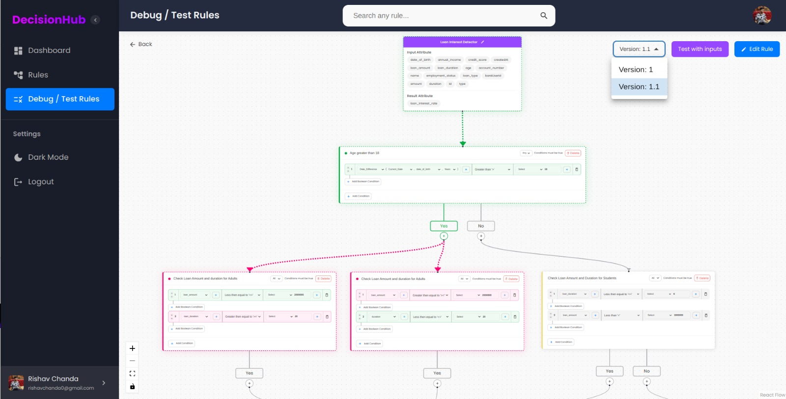  |
| 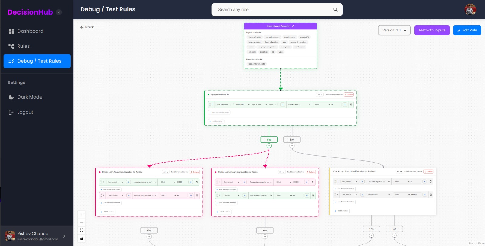  |
| 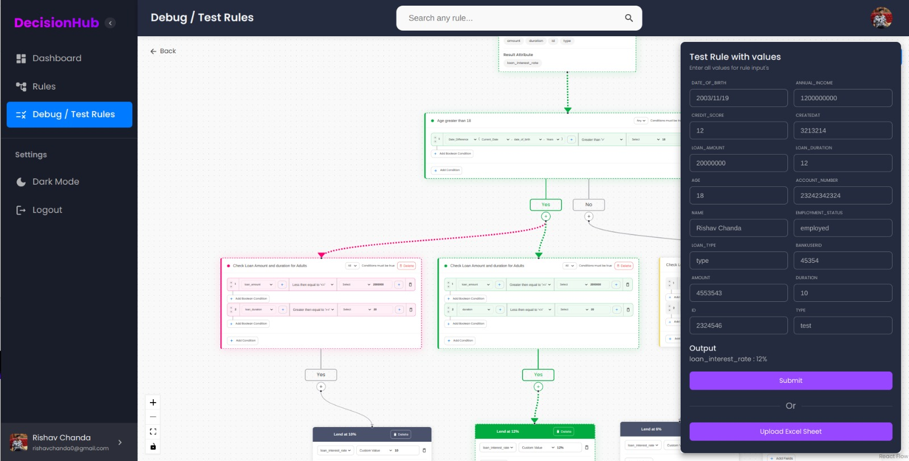  |
| 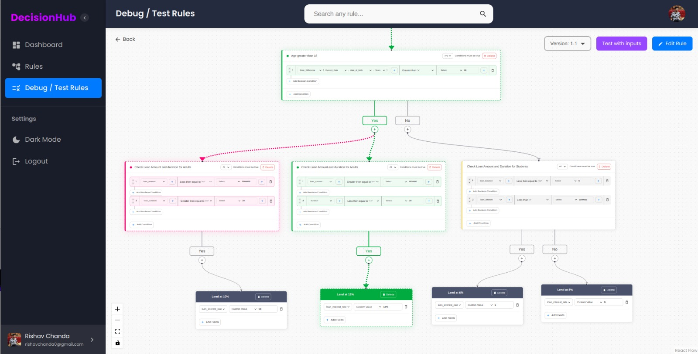 |
| 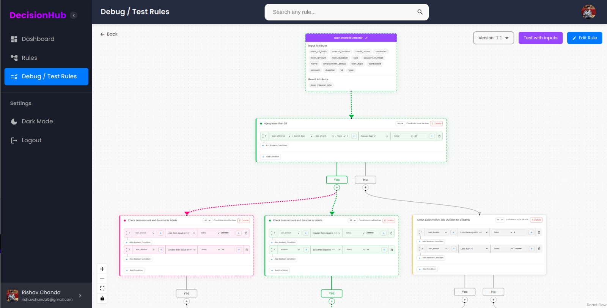 |

## Features

- User Authentication:
  - Users can login to the service using their emails or using Google Accounts
- Rules Management:
  - Add Rules : Users can create rules for more than one database, including rule description, input attributes, output attributes
  - Create Conditions : Users can either create conditions or generate one using AI for a rule
  - Versions : Users can store multiple versions of a rule
- AI:
  - Leverages the power of AI to create rules based on User prompt
- Debug and Testing
  - Debug & Testing : User can debug and test rule with various input to get the desired result.
- Graphical Information:
  - Tree : A tree like rule creation such that, visualisation of rules is easier
